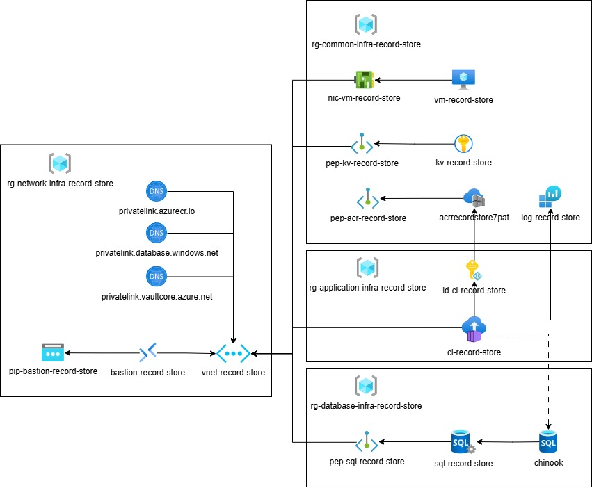
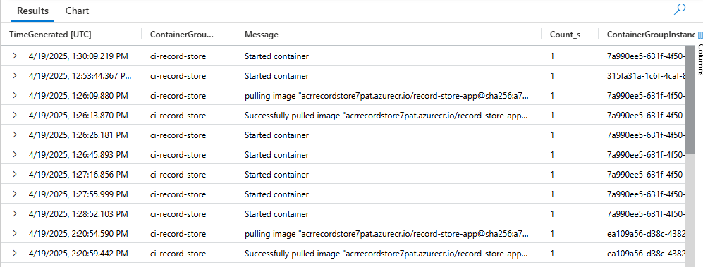
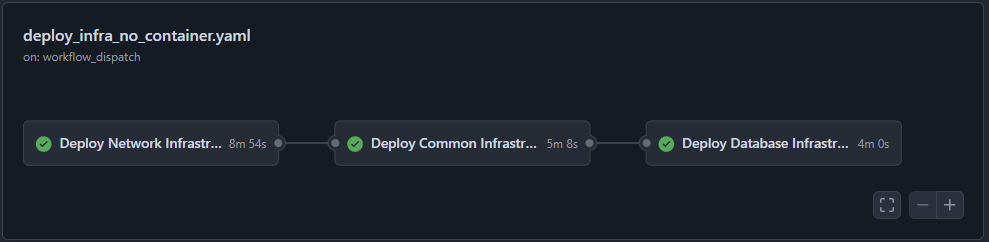

# App as a Container on Azure

This repository demonstrates how to containerize the [Record Store Application](https://github.com/MaryKroustali/record_store_app) and deploy it to Azure using serverless container hosting services.

## Containerization

### Preparation
The application is first upgraded to ASP.NET Core using [Visual Studio 2022](https://learn.microsoft.com/en-us/aspnet/core/migration/mvc?view=aspnetcore-9.0) to enable easy containerization in a Linux environment.

### Container Image
The application is containerized using [Visual Studio Container Tools](https://learn.microsoft.com/en-us/visualstudio/containers/overview?view=vs-2022&toc=%2Fdotnet%2Fnavigate%2Fdevops-testing%2Ftoc.json&bc=%2Fdotnet%2Fbreadcrumb%2Ftoc.json) or [Docker Desktop](https://learn.microsoft.com/en-us/dotnet/core/docker/build-container?tabs=linux&pivots=dotnet-8-0#create-the-dockerfile).
The following `Dockerfile` is used:
```Dockerfile
FROM mcr.microsoft.com/dotnet/sdk:8.0@sha256:35792ea4ad1db051981f62b313f1be3b46b1f45cadbaa3c288cd0d3056eefb83 AS build
WORKDIR /App

# Copy everything
COPY . ./
# Restore as distinct layers
RUN dotnet restore
# Build and publish a release
RUN dotnet publish -o out

# Build runtime image
FROM mcr.microsoft.com/dotnet/aspnet:8.0@sha256:6c4df091e4e531bb93bdbfe7e7f0998e7ced344f54426b7e874116a3dc3233ff
WORKDIR /App
COPY --from=build /App/out .
# Replace with project's dll file
ENTRYPOINT ["dotnet", "WebApplication8Core.dll"]
```
A docker image named `record-store-app` is built using the following command:
```bash
docker build -t record-store-app .
```

### Running Locally
To test the application, a local container can be created:
```bash
sudo docker run -p 8080:8080 -it --rm record-store-app
```
The application is accessible at http://localhost:8080.

## Container Registry
The image is pushed to [Github Container Registry](https://docs.github.com/en/packages/working-with-a-github-packages-registry/working-with-the-container-registry) to be publicly available.

1. Authenticating to the registry:
```bash
export CR_PAT=<PAT> # PAT must include write:packages permission
echo $CR_PAT | docker login ghcr.io -u <USERNAME> --password-stdin
```
2. Tagging and pushing the image:
```bash
docker tag record-store-app ghcr.io/<USERNAME>/record-store-app:1.0.0
docker push ghcr.io/<USERNAME>/record-store-app:1.0.0
```
3. The image can be pulled using:
```
docker pull ghcr.io/USERNAME/record-store-app:1.0.0
```
Also available at [Github Packages](https://github.com/users/MaryKroustali/packages/container/package/record-store-app).

## Hosting on Azure
For deployment, the architecture from the [private_app_on_azure](https://github.com/MaryKroustali/private_app_on_azure) repository can be used. An App Service can consume a container by setting the `linuxFxVersion` property:
```bicep
resource app_service 'Microsoft.Web/sites@2023-12-01' = {
  name: name
  location: location
  properties: {
    serverFarmId: asp_id
    siteConfig: {
      linuxFxVersion: 'ghcr.io/<USERNAME>/record-store-app:1.0.0'
    }
  }
}
```
Alternatively, Azure provides multiple [container-based](https://azure.microsoft.com/en-us/products/category/containers) hosting solutions. For simplicity, the architecture in this repository uses:
- `Container Registry (acrrecordstore7pat)`: To store the container image
- `Container Instances (ci-record-store)`: For lightweight deployment
- `User-assigned Managed Identity (id-ci-record-store)`: For authorizing the Container Instance to pull images from the Container Registry



### Network Configuration
To secure the image access, a private Azure Container Registry (ACR) is used with a private endpoint and a private DNS zone `privatelink.azurecr.io`.

Azure Container Instances operate within a delegated subnet and are accessed through private IPs only.

The GitHub Runner functions as a jump host to interact with the private network.

### Github Runner
A Linux virtual machine is configured as a GitHub self-hosted runner using a [bash script](./scripts/buildagent.sh). It installs:
- Azure CLI
- Docker

The runner pulls the image from GitHub, tags it and pushes it to the private ACR. The service principal used for this task requires `AcrPush` permissions.

### Application Deployment
In this architecture, App Service, App service Plan and Application Insights are removed.

The Container Instance pulls the image from the private ACR using a **user-assigned managed identity** with `AcrPull` permissions.

To test the deployment, the GitHub Runner can be used as a jump host to connect into the private network and `curl` the private IP address of the container instance.

**Monitoring**

Logs and basic container insights are available in Log Analytics Workspace resource under `ContainerEvent_CL` table:



## Github Actions
Several workflows automate the deployment process. These are similar to those found in the [private_app_on_azure](https://github.com/MaryKroustali/private_app_on_azure?tab=readme-ov-file#github-actions) repository:
- `Deploy Infrastructure`: Creates the necessary Azure resources (excluding the container).

- `Push Image to ACR`: Tags and pushes the Docker image to ACR, using the Github Runner.
- `Deploy Container`: Deploys the container to Azure after the image is available.
- `Import Data to Database`: Importing data into the SQL database.

[](https://github.com/MaryKroustali/containerized_app_on_azure/actions/workflows/deploy_infra_no_container.yaml)  [](https://github.com/MaryKroustali/containerized_app_on_azure/actions/workflows/push_to_registry.yaml) [](https://github.com/MaryKroustali/containerized_app_on_azure/actions/workflows/deploy_container.yaml) [](https://github.com/MaryKroustali/containerized_app_on_azure/actions/workflows/import_db_data.yaml)

## Limitations
- Container Instances are ephemeral and not ideal for long-running production workloads.
- Azure Container Instances do not support autoscaling.
- ACI logs are available via Container Insights but lack long-term aggregation features.

# Next Steps
[kubernetes_app_on_azure](https://github.com/MaryKroustali/kubernetes_on_azure): Deploying the Record Store application using Azure Kubernetes Service (AKS).